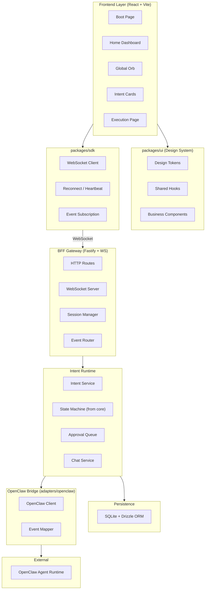
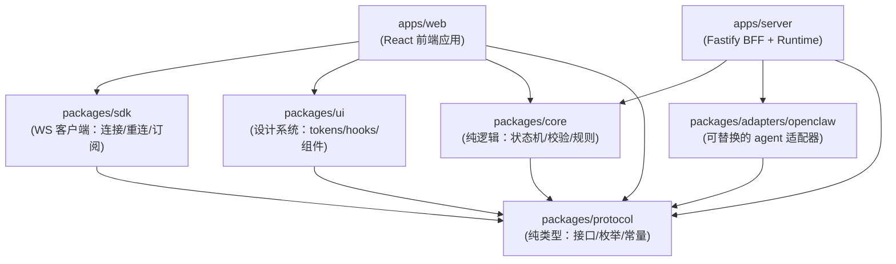
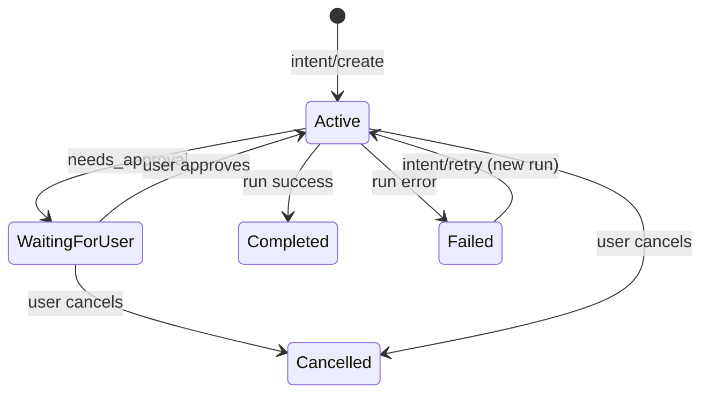

# IntentOS 项目架构设计（优化版）

## 1. 系统分层架构




### 各层职责

- **Frontend Layer**: 纯 UI 渲染 + 用户交互，不包含业务逻辑，通过 SDK 与 BFF 通信
- **packages/protocol**: 共享契约 — 类型、`as const` 常量、纯函数（validate/parse/guard）。被所有其他包消费。
- **packages/core**: 纯领域逻辑 — 状态机、转换规则、校验函数、`deriveIntentSummary()` + `deriveRunStatus()` 投影函数（各自只消费一个 stream）。纯计算无 IO。被 web 和 server 共同消费。
- **packages/sdk**: 封装 WebSocket 连接管理、断线重连、事件订阅，提供类型安全的 API。只依赖 protocol，不依赖 React。
- **packages/ui**: 设计系统 — tokens 提供跨端一致的设计变量（平台无关纯数据），hooks 提供共享的 React 逻辑，components 提供基于 shadcn 二次封装的业务组件
- **packages/adapters/openclaw**: 可替换的 agent 适配器，只依赖 protocol，不依赖 server 内部逻辑
- **BFF Gateway (apps/server)**: 面向 UI 的网关，管理会话、根据 contextId 预取上下文数据附加到消息、协议转换、事件映射。不做消息分类或 agent 路由。消费 core + adapters + protocol。
- **Persistence**: SQLite 存储意图状态、聊天记录、审批记录，确保刷新不丢失

### 包的边界规则

每个包都有明确的"能依赖什么"和"不能依赖什么"的约束：

- `protocol`: 不依赖任何内部包，不依赖 Node/React/任何框架。只导出类型（type/interface/enum）、`as const` 常量、以及纯函数（无副作用、无 IO，仅用于 validate/parse/guard，如 `parseEnvelope()`、`isEventType()`）。禁止导出业务逻辑函数。
- `core`: 依赖 protocol（允许 import 常量和类型，不限于 `import type`）。约束是"纯计算、无 IO"：禁止依赖 ws/express/fastify/fs/process/fetch 等运行时 IO。
- `sdk`: 只依赖 protocol。不依赖 React（纯 TS，浏览器 WebSocket 环境）。
- `ui`: 依赖 protocol。通过 package.json subpath exports 分离：`@intentos/ui/tokens`（平台无关纯数据，不依赖 React）和 `@intentos/ui/react`（hooks + 组件，依赖 React）。
- `adapters/openclaw`: 只依赖 protocol。不依赖 server 内部模块。
- `apps/web`: 消费 protocol + core + sdk + ui。
- `apps/server`: 消费 protocol + core + adapters/openclaw。

### 包间依赖关系




### 核心原则

- UI 永远只对接 BFF 的标准协议，不直接理解 OpenClaw 的消息结构
- 所有对话始终通过 OpenClaw Main Agent，BFF 只做上下文附加和协议转换，不做消息分类或路由
- 快速问答 vs 创建意图 vs 任务相关问题的判断全部由 Main Agent 完成
- `contextId` 告诉 BFF 预取哪个 intent 的状态数据，不用于 agent 路由
- BFF 不做分类但必须做安全策略门（auth/risk 类审批强制用户确认）
- UI 最终状态只能由 EVT [R] 事件推导，NOTIFY [E] 只是体验增强
- 前后端通过 `packages/protocol` 共享所有类型定义和 EVENT_META，编译期保证类型安全
- 前后端通过 `packages/core` 共享意图状态机逻辑，core 投影函数只接受 [R] 事件

---

## 2. 技术选型


| 领域          | 选型                          | 理由                       |
| ----------- | --------------------------- | ------------------------ |
| Monorepo 管理 | pnpm + Turborepo            | 社区主流、缓存加速、依赖管理干净         |
| 前端框架        | React 19 + Vite             | 生态最大、Vite 构建快            |
| UI 组件       | shadcn/ui + Tailwind CSS 4  | 可定制、开源友好、不引入运行时          |
| 状态管理        | Zustand                     | 轻量、TS 友好、适合事件驱动更新        |
| 动画          | Framer Motion               | 小球拖拽/吸边/状态变化动效           |
| 路由          | React Router v7             | 成熟稳定                     |
| Server 框架   | Fastify                     | TS 原生、插件化、高性能            |
| WebSocket   | ws (via @fastify/websocket) | 稳定、低开销                   |
| 数据库         | SQLite + Drizzle ORM        | 零配置、类型安全、后续可切 PostgreSQL |
| 代码质量        | ESLint + Prettier + Husky   | 开源项目标配                   |
| 测试          | Vitest                      | 与 Vite 同生态、速度快           |
| CI          | GitHub Actions              | 社区标准                     |


---

## 3. 目录结构

```
intentos/
  README.md
  LICENSE                        # Apache-2.0 或 MIT
  CONTRIBUTING.md
  CODE_OF_CONDUCT.md
  .github/
    workflows/
      ci.yml                     # lint + typecheck + test + build
      release.yml

  docs/
    architecture/
      overview.md                # 意图中心 OS 的核心理念
      intent-model.md            # 意图状态机文档
    protocol/
      websocket.md               # WS 协议规范
      events.md                  # 事件类型文档
    plans/                       # 设计文档存放处

  packages/
    protocol/                    # 前后端共享的契约（类型 + as const 常量 + 纯函数）
      src/
        envelope.ts              # Envelope 类型（kind/debugActor?/scopeId/clientId/sessionId/streamId/serverSeq/clientSeq/traceId/reqId）
        constants.ts             # 状态枚举（IntentStatus, RunStatus 等 as const）
        guards.ts                # 纯函数：parseEnvelope(), isEventType() 等
        event-meta.ts            # EVENT_META 映射：每个事件类型的 { replayable, stream, since } + isReplayable()/getStream()。不含 kind/direction（连接方向由 WS 本身决定）
        stream-id.ts             # STREAM_ID_PATTERN 正则 + isValidStreamId() + parseStreamId()
        events/
          auth.ts                # auth/* 事件类型
          intent.ts              # intent/* 事件类型
          run.ts                 # run/* 事件类型（run/started, run/step_upserted, run/snapshot 等）
          stream.ts              # stream/* 事件类型（stream/subscribe, stream/subscribe_ok, stream/unsubscribe）
          chat.ts                # chat/* 事件类型
          boot.ts                # boot/* 事件类型
          suggestion.ts          # suggestion/* 事件类型
          index.ts
        dto/
          intent.ts              # IntentDTO, IntentRunDTO
          run-step.ts            # RunStepDTO（执行步骤，Timeline 展示）
          artifact.ts            # ArtifactDTO（kind/content/url）
          approval.ts            # ApprovalDTO（confirm/choice/form/auth/risk）
          suggestion.ts          # IntentSuggestionDTO
          message.ts             # ChatMessage DTO
          error.ts               # IntentError（category/retryable）
          index.ts
        errors.ts                # 统一错误码
        index.ts
      package.json
      tsconfig.json

    core/                        # 纯领域逻辑（纯计算、无 IO）
      src/
        intent/
          state-machine.ts       # Intent 状态转换逻辑
          projections.ts         # deriveIntentSummary(globalEvents[]) + deriveRunStatus(runEvents[]) — 各自只消费一个 stream，不跨 stream 合并
          transitions.ts         # 合法状态转换规则
          validators.ts          # canCancel(), canRetry() 等业务校验
          index.ts
        run/
          state-machine.ts       # IntentRun 状态转换逻辑
          index.ts
        approval/
          validators.ts          # 审批决策校验
          index.ts
        index.ts
      package.json
      tsconfig.json

    sdk/                         # 前端 WS 客户端 SDK
      src/
        client.ts                # AIOSClient 类
        reconnect.ts             # 断线重连 + 心跳
        subscriptions.ts         # 事件订阅管理
        seq-tracker.ts           # per-stream seq 跟踪 + gap 检测 + 自动重订阅恢复
        index.ts
      package.json
      tsconfig.json

    ui/                          # 设计系统（subpath export: @intentos/ui/tokens + @intentos/ui/react）
      src/
        tokens/                  # @intentos/ui/tokens — 平台无关纯数据，不依赖 React
          colors.ts              # 颜色变量（语义化 + 原始色板）
          spacing.ts             # 间距比例
          typography.ts          # 字体族、字号、行高
          radius.ts              # 圆角
          shadows.ts             # 阴影
          animation.ts           # 动画曲线、时长
          motion.ts              # 统一动效：easing 曲线、duration、小球动画参数
          tokens.json            # 全量 tokens 的 JSON 输出（鸿蒙/桌面端直接消费）
          index.ts               # 统一导出 TS 常量
        react/                   # @intentos/ui/react — React hooks + 业务组件
          hooks/
            useMediaQuery.ts
            useTheme.ts
            useBreakpoint.ts
            index.ts
          components/            # 基于 shadcn 二次封装的业务组件
            IntentCard/
              IntentCard.tsx
              IntentCard.stories.tsx
              index.ts
            StatusBadge/
              StatusBadge.tsx
              index.ts
            OrbBubble/
              OrbBubble.tsx
              index.ts
            index.ts
          index.ts
      package.json               # exports: { "./tokens": ..., "./react": ... }
      tsconfig.json

    adapters/
      openclaw/                  # OpenClaw 适配器
        src/
          client.ts              # OpenClaw API 客户端
          event-mapper.ts        # OpenClaw 事件 -> 标准事件
          tool-mapper.ts         # 工具调用映射
          index.ts
        package.json
        tsconfig.json

  apps/
    web/                         # React Web 前端
      src/
        app/
          App.tsx
          router.tsx
          providers.tsx          # Zustand / SDK / Theme providers
        features/
          boot/                  # 引导加载页
            BootPage.tsx
            BootProgress.tsx
            useBootStatus.ts
          home/                  # 主界面
            HomePage.tsx
            RecommendedIntents.tsx
            ActiveIntents.tsx
          orb/                   # AI 小球
            Orb.tsx
            OrbBubble.tsx        # 对话气泡
            OrbContextMenu.tsx   # 右键菜单
            useOrbDrag.ts        # 拖拽/吸边 hook
            useOrbState.ts       # 小球状态 hook
          intents/               # 意图卡片
            IntentCard.tsx
            IntentCardList.tsx
            IntentStatusBadge.tsx
          execution/             # 执行页（进入卡片后的详情）
            ExecutionPage.tsx
            ExecutionTimeline.tsx
            ApprovalPanel.tsx
            ArtifactViewer.tsx
        components/
          ui/                    # shadcn/ui 组件（由 CLI 生成）
        hooks/                   # 通用 hooks
        lib/                     # 工具函数
        stores/                  # Zustand stores
          intentStore.ts
          chatStore.ts
          orbStore.ts
          bootStore.ts
        styles/
          globals.css            # Tailwind 入口
        main.tsx
      public/
      index.html
      vite.config.ts
      tailwind.config.ts
      components.json            # shadcn 配置
      package.json
      tsconfig.json

    server/                      # Fastify BFF + Intent Runtime
      src/
        config/
          env.ts                 # 环境变量校验 (zod)
          logger.ts              # 日志配置
        http/
          routes.ts              # REST 路由注册
          health.ts              # /health 端点
          debug.ts               # /debug/intents, /debug/runs/:runId/events, /debug/rebuild-global（只重建 intent_summary 表，不重写 global stream event store）
        ws/
          server.ts              # WS 服务器初始化
          sessions.ts            # WS 会话管理
          auth.ts                # handshake 认证处理
          throttle.ts            # 事件推送节流
          handlers/
            auth.ts              # auth/* 事件处理
            intent.ts            # intent/* 命令处理（create/cancel/retry）
            run.ts               # run/* 命令处理（approve）
            stream.ts            # stream/* 命令处理（subscribe/unsubscribe，统一订阅入口）
            chat.ts              # chat/* 事件处理
            boot.ts              # boot/* 事件处理
            suggestion.ts        # suggestion/* 事件处理
            protocol-guard.ts    # 协议校验中间件：CMD 必须有 clientId+clientSeq+reqId、连接方向+kind、事件类型/stream 合法性
            index.ts
        intent/
          service.ts             # 意图 CRUD + 业务逻辑
          run-service.ts         # IntentRun 管理（创建/重试/状态）
          runtime.ts             # 意图执行运行时
          store.ts               # Intent + Run 数据库访问层
          event-store.ts         # 双层 event store：intent/* → global, run/* → run（禁止双写，EVENT_META 校验，serverSeq 事务内分配）
          stream-head.ts         # stream_head 表管理：per-stream lastSeq 持久化（BEGIN IMMEDIATE 事务内 lastSeq+1，保证单调递增 + 并发安全）
          write-queue.ts         # per-stream 写入队列：串行化 event 写入，防止并发 seq 重复
          idempotency.ts         # (scopeId, clientId, reqId) 幂等去重表，存 ackPayload + payloadHash（mismatch 拒绝）
          summary-projector.ts   # intentSummaryProjector：intent/status_changed 唯一产出源，输入为 intent/run 关键状态事件，确定性投影规则
          policy-gate.ts         # agent 结果 policy gate：adapter 的工具执行结果进入 [R] 事件前必须过此门，未审批的高危 tool 结果只能产出 run/needs_approval
        chat/
          service.ts             # 聊天（快速问答）服务
        suggestion/
          service.ts             # 推荐意图服务
        boot/
          checker.ts             # 环境检查器
        bridge/
          openclaw.ts            # 调用 adapters/openclaw
        db/
          schema.ts              # Drizzle schema（intent/run/event/approval/artifact/stream_head/idempotency/intent_summary 表）
          migrations/
          index.ts
        index.ts
      drizzle.config.ts
      Dockerfile
      package.json
      tsconfig.json

  tools/                         # 共享工具配置
    eslint/
      base.js
    tsconfig/
      base.json
      react.json
      node.json
    prettier/
      index.js

  pnpm-workspace.yaml
  turbo.json
  package.json                   # root: scripts + devDependencies
  .gitignore
  .editorconfig
  .env.example
```

---

## 4. 协议设计

### 4.1 统一消息封装 (Envelope)

```typescript
type Envelope<T = unknown> = {
  id: string;              // 消息唯一 ID (nanoid)
  version: number;         // 协议版本（默认 1，未来升级协议时递增）
  kind: 'cmd' | 'ack' | 'evt' | 'notify';  // 协议角色
  type: string;            // 事件类型 (namespace/action)
  ts: number;              // Unix 毫秒时间戳

  debugActor?: 'client' | 'server';  // 仅 debug/日志用，可选，不得用于拒绝消息
  scopeId?: string;        // 数据分区（handshake_ok 下发，如 workspaceId/userId/installationId），后续所有消息携带
  clientId?: string;       // 设备级标识（handshake 时获取，持久化 localStorage），CMD 必填
  sessionId?: string;      // handshake 后下发，所有后续消息携带

  streamId?: string;       // 事件所属的 stream（'global' | 'run:<runId>'），仅 kind=evt 且 replayable=true 时必填。NOTIFY 永远不携带 streamId。
  serverSeq?: number;      // stream 内递增序号，仅 kind=evt 且 replayable=true 时必填。NOTIFY 永远不携带 serverSeq。
  clientSeq?: number;      // client -> server CMD 递增序号（session 内递增），CMD 必填，用于调试/对账

  traceId?: string;        // 链路追踪 ID（贯穿 cmd → ack → evt → OpenClaw → evt 整条链路，不等于 runId）
  reqId?: string;          // 请求关联 ID：CMD 必填（client 生成），ACK 原样回传，EVT/NOTIFY 可选关联。替代原 requestId + correlationId（只保留一个字段，避免团队混用）

  payload: T;              // intentId/runId 放在 payload 里，不在 Envelope 顶层重复
};
```

**安全硬约束：连接方向 + `kind`（唯一真值）：**
- **server 对所有 WS client 入站消息强制视为 client 发送**，只允许 `kind=cmd`，违反则拒绝
- **client 对所有 server 入站消息只允许 `kind in {ack, evt, notify}`**，违反则丢弃
- `debugActor?` 为可选字段，仅用于日志/调试，发送方可选填写，接收方完全忽略（不校验、不告警、不拒绝）
- `assertEnvelope()` 只硬校验：`kind` 是否合法 + `kind=cmd` 时必填字段（clientId/clientSeq/reqId）+ `kind=evt && replayable` 时必填字段（streamId/serverSeq）

**`scopeId` 规则：**
- `handshake_ok` 中下发 `scopeId`（当前匿名模式为自动生成的 installationId）
- 后续所有消息必须携带 `scopeId`
- DB 所有表的主键包含 `scopeId`：`stream_head(scopeId, streamId, lastSeq)`、event store `(scopeId, streamId, serverSeq)`、幂等表 `(scopeId, clientId, reqId)`
- 未来支持多用户/多设备时，只需改 `scopeId` 的生成逻辑，不需要迁表

### 4.2 核心数据模型

**Intent（意图）与 IntentRun（执行）分离：**

```typescript
// Intent = 任务定义（不变的）
type IntentDTO = {
  id: string;
  title: string;
  originalMessage: string;    // 用户原始输入
  context?: ChatMessage[];    // 触发创建前的对话上下文
  status: IntentStatus;       // 当前最新 run 的状态（冗余，方便 UI）
  currentRunId?: string;
  createdAt: number;
};

// IntentRun = 某一次执行（可重试，每次重试是新的 run）
type IntentRunDTO = {
  id: string;                 // runId
  intentId: string;
  status: RunStatus;
  startedAt: number;
  completedAt?: number;
  error?: IntentError;
  artifacts: ArtifactDTO[];
};

// 状态枚举
const IntentStatus = {
  Active: 'active',           // 有 run 在执行
  WaitingForUser: 'waiting',  // 需要用户介入
  Completed: 'completed',
  Failed: 'failed',
  Cancelled: 'cancelled',
  Desynced: 'desynced',       // ⚠ client-only：投影函数检测到 seq 不连续时返回，server/DB 永远不存储此值
} as const;

const RunStatus = {
  Queued: 'queued',
  Running: 'running',
  WaitingForUser: 'waiting_for_user',
  Completed: 'completed',
  Failed: 'failed',
  Cancelled: 'cancelled',
} as const;
```

**Artifact（任务产物）模型：**

```typescript
type ArtifactDTO = {
  id: string;
  intentId: string;
  runId: string;
  kind: 'text' | 'markdown' | 'file' | 'link' | 'image' | 'json';
  title: string;
  content?: string;          // text/markdown/json 直接放内容
  url?: string;              // file/link/image 放 URL
  mimeType?: string;
  createdAt: number;
};
```

**Approval（交互节点）通用模型：**

```typescript
type ApprovalDTO = {
  id: string;
  intentId: string;
  runId: string;
  kind: 'confirm' | 'choice' | 'form' | 'auth' | 'risk';
  title: string;
  description?: string;
  schema?: ApprovalSchema;    // 选项列表 / 表单字段定义
  deadline?: number;          // 超时自动决定
  defaultDecision?: string;
  blocking: boolean;          // 是否阻塞执行
  createdAt: number;
};
```

**IntentError（错误分类）：**

```typescript
type IntentError = {
  code: string;
  message: string;
  category: 'transient' | 'permanent' | 'user_action_required';
  retryable: boolean;
  details?: unknown;
};
```

**RunStep（执行步骤，用于 Timeline 展示）：**

```typescript
type RunStepDTO = {
  id: string;
  runId: string;
  kind: string;              // 可扩展：'plan' | 'tool' | 'thought' | 'checkpoint' | 'artifact' | 'approval' | ...
  title: string;
  status: 'queued' | 'running' | 'done' | 'failed';
  progress?: number;         // 0..1
  startedAt?: number;
  endedAt?: number;
  data?: unknown;            // 按 kind 不同携带不同数据（tool input/output 等）
};
```

**IntentSuggestion（推荐意图）：**

```typescript
type IntentSuggestionDTO = {
  id: string;
  title: string;
  description: string;
  icon?: string;
  category?: string;         // 工作/娱乐/效率/...
  templateMessage?: string;  // 点击后预填的消息
};
```

### 4.3 事件类型（最小可用集合）

每个事件标注三个维度：

- **角色**：CMD（客户端命令）/ ACK（命令确认）/ EVT（状态事实）/ NOTIFY（体验通知）
- **持久化**：[R]（入 event store，可重放）/ [E]（瞬时，不入库）
- **Stream**：Global / Run / 无（[E] 事件无 stream）

**分类原则：**

- CMD（`kind=cmd`）→ 始终 [E]，不入 event store。**CMD 必须携带 `clientId` + `clientSeq` + `reqId`**，server 用 `(scopeId, clientId, reqId)` 作为幂等主键。`clientSeq` 用于调试/对账。
- ACK（`kind=ack`）→ [E]，带 `reqId`（原样回传 CMD 的 reqId）+ `clientSeq` + `accepted: boolean` + `reason?`。**ACK 只表示命令被接受/拒绝，不表示操作已完成**。回传 `clientSeq` 便于客户端对账和调试。状态变化永远靠 EVT。
- EVT（`kind=evt`）→ [R]，入 event store，可重放。**同一条 EVT 只写入一个 stream，禁止双写。** EVT 必须携带 `streamId` + `serverSeq`。
- NOTIFY（`kind=notify`）→ [E]，丢了不影响状态一致性。**NOTIFY 永远不携带 `streamId` / `serverSeq`**，不参与 cursor/重放/gap 检测。

**核心约束（可测试）：**

- **UI 的最终状态只能由 EVT [R] 事件推导。** NOTIFY [E] 事件只能更新"体验层 overlay"（进度条、动画），永远不写入状态 store。
- **投影函数不跨 stream 合并。** core 提供两个独立投影函数，各自只消费一个 stream：
  - `deriveIntentSummary(globalEvents[])` — 首页用，只接受 global stream 的 [R] 事件
  - `deriveRunStatus(runEvents[])` — 执行页用，只接受单个 run stream 的 [R] 事件
  - UI 层决定展示哪个：首页展示 intent summary，执行页展示 run status
  - **禁止在前端做跨 stream join**（断线重放时两个 stream 到达顺序不可控）
- 投影函数输入约束：同一 stream 内按 `serverSeq` 严格递增；如果 seq 不连续（缺事件），返回 `status: 'desynced'` 异常态。
- **desynced 自动恢复（SDK 层）**：SDK 收到 `kind=evt` 时检查 `serverSeq` 是否连续（预期 = lastSeq + 1）。**gap 检测只对 `kind=evt && replayable=true` 的事件生效**，NOTIFY 完全不参与。如果发现 gap（例如本地 lastSeq=5 但收到 seq=7），SDK 自动触发该 stream 的重订阅：发送 `stream/subscribe`（带本地最后有效 cursor），server 从缺失位置开始重传。UI 在 gap 期间展示 desynced 状态，补齐后自动恢复。
  - **gap 修复失败终止策略（硬规则）**：最多重试 N 次（默认 3 次），仍有 gap 则 SDK 发送无 cursor 的 `stream/subscribe`（强制 reset）。server 必须在 `subscribe_ok` 中返回 `reset: true`，client 收到后**清空该 stream 的全部本地缓存**，然后接收 server 发来的 snapshot（或全量 EVT 重放）。这保证 desynced 不会变成永久状态。
- **安全硬约束只看连接方向 + kind**：server 收到 `kind !== cmd` 的 client 消息直接拒绝；client 收到 `kind === cmd` 的 server 消息直接丢弃。`debugActor?` 完全忽略，不参与任何校验。
- **NOTIFY 不能触发状态变化（硬约束）**：任何 run 的状态变化只能由 `kind=evt` 事件触发（`run/started`, `run/needs_approval`, `run/completed`, `run/failed`, `run/cancelled`）。`run/progress` NOTIFY 只能在 `run/started` EVT 之后出现，否则 client 丢弃；server 也必须 enforce：如果 run 未 started，禁止发 progress。**NOTIFY 永远不携带 streamId/serverSeq。**
- protocol 中的 `EVENT_META` 映射为每个事件类型标注 `{ replayable, stream, since }`，`isReplayable(type)`、`getStream(type)` 作为纯函数导出。
  - **EVENT_META 不含 `kind`**：生产环境 `kind` 的真值来源 = wire 上的 `Envelope.kind`，不做任何 meta 比对。
  - **EVENT_META 不含 `direction`**：连接方向已由 WebSocket 本身决定（server 入站 = client 消息，只允许 cmd），无需在 meta 中重复。开发期可加 dev-only 断言。
  - `assertEnvelope()` 只校验：(1) `kind` 是否匹配连接方向（c2s→cmd，s2c→ack/evt/notify），(2) `kind=cmd` 时必填字段，(3) `kind=evt && replayable` 时必填字段。不引用 EVENT_META 做 kind/direction 比对。
- server 的 event-store 根据 `EVENT_META` 校验：只有 `kind=evt && replayable=true` 的事件才能入库，且必须写入正确的 stream。server 用 `(scopeId, clientId, reqId)` 做幂等去重（SQLite 一张小表，`ackPayload` 原样回放）。

**streamId 枚举空间（写入 protocol，强校验）：**

```typescript
// 合法 streamId 格式（正则）
const STREAM_ID_PATTERN = /^(global|run:[a-zA-Z0-9_-]+)$/;

// 当前支持的 streamId 前缀
type StreamIdPrefix = 'global' | 'run';

// 预留（不实现，但写进协议作为未来扩展方向）：'boot'、'chat:<threadId>'
```

server 对未知前缀的 streamId 拒绝订阅、拒绝入库。

**Event Store 双层 stream 硬规则（禁止双写）：**

- **Global stream**（streamId: `'global'`）：只允许 `intent/`* 命名空间的轻量摘要事实
  - 允许：`intent/created`、`intent/status_changed`
  - 禁止：任何 `run/*` 事件、任何执行细节（step/approval/artifact）
- **Run stream**（streamId: `'run:<runId>'`）：只允许 `run/`* 命名空间的执行事实
  - 允许：`run/started`、`run/step_upserted`、`run/needs_approval`、`run/approval_recorded`、`run/completed`、`run/failed`、`run/cancelled`
  - `run/snapshot` 是 NOTIFY [E]，不入 event store，不参与 stream seq
  - 禁止：任何 `intent/*` 事件
- **命名空间与 stream 一一对应**：`intent/`* EVT → global stream，`run/*` EVT → run stream
- 首页订阅 global stream（轻量摘要），执行页订阅对应 run stream（详细事实）
- `intent/status_changed` 是首页获知意图最新状态的唯一途径（**冗余摘要 / derivative event**，只由 `intentSummaryProjector` 产出），payload 为"首页卡片一包够用"摘要：`{ intentId, title, summary?, status, currentRunId, updatedAt, needsAttention, progress?, artifactCount?, artifactPreview? }`（不含 `runHeadSeq`，避免诱导跨 stream join）
  - `/debug/rebuild-global` **只重建 `intent_summary` 表**（DB 物化视图），不重写 global stream event store（否则所有 client cursor 失效）。global stream 始终 append-only。
  - 首页以 `global/snapshot`（读 intent_summary 表）+ 增量 EVT 为准，rebuild 只影响 snapshot 内容。

**Global stream 膨胀控制：**

- 同一个 intent 的多条 `intent/status_changed` 会导致 global stream 膨胀。为防止首页重放越来越慢：
- server 维护 `intent_summary` 表：每个 intent 一行，存最新摘要（由 `intent/status_changed` 写入时同步更新）
- 首页订阅 global stream 时：server 先发 `global/snapshot` NOTIFY [E]（含所有活跃 intent 的最新摘要数组），再从 cursor 位置补增量 EVT
- `global/snapshot` NOTIFY [E] — `{ v: 1, snapshotId, intents: IntentSummaryDTO[], atSeq: number, headSeq: number }`（与 `run/snapshot` 同样的版本化 + catchup 语义，不入 event store。client 不认识 `v` 时忽略 snapshot，发送无 cursor 的 `stream/subscribe` 触发全量重放）
- 长期运行后可选：对 global stream 做归档压缩（同一 intent 只保留最新一条 `intent/status_changed`），但 MVP 不实现

**cursor 结构（带版本 + 紧凑数组 + 清理策略）：**

```typescript
type CursorItem = {
  s: string;     // streamId
  q: number;     // lastServerSeq
  t: number;     // 最后更新 Unix 毫秒时间戳（用于 SDK 清理过期 stream）
};

type Cursor = {
  v: 1;                  // cursor 版本，协议升级时递增
  items: CursorItem[];   // 紧凑数组，避免 Record 无限增长
};
```

**SDK cursor 清理策略**：`global` 永远保留；run stream 只保留最近 20 个（按 `t` 排序淘汰最旧的）。超出上限的 run stream 在下次 subscribe 时无 cursor（全量重放）。

server 收到 cursor 时检查 `v` 兼容性和 stream 有效性，不兼容时在 `stream/subscribe_ok` 中回传 `reset: true`。

**连接生命周期 [E]：**

- `auth/handshake` CMD — `{ token?, deviceId? }`（handshake 是唯一不需要 clientId/clientSeq 的 CMD）
- `auth/handshake_ok` ACK — `{ sessionId, userId?, clientId, scopeId, accepted: true }`（`clientId` 设备级持久；`scopeId` 数据分区标识，匿名模式为自动生成的 installationId）
- `auth/handshake_failed` ACK — `{ accepted: false, reason }`

**引导启动 [E]（不参与 cursor/重放/event store）：**

- `boot/check` CMD — 请求启动检查
- `boot/progress` NOTIFY — `{ checkId, label, state: 'running' | 'ok' | 'fail', error?, step, total }`
- `boot/ready` NOTIFY — 启动完成

Boot 事件全部 `replayable: false`，`stream: null`。**server 不允许将 boot 事件写入 event store，不分配 streamId/serverSeq，不参与 cursor。** UI 刷新时 boot 重新执行即可（这是预期行为）。

Boot 检查项（最小可验证集合）：

- `server_ready`：本地服务/WebSocket 连接可用
- `agent_ready`：server 侧至少有一个可用的 agent runtime（真 OpenClaw 或 mock echo agent）。原型期 mock agent 必须内置且默认启用，确保社区用户无需安装 OpenClaw 即可进入主界面。真 OpenClaw 可用时显示增强信息 "OpenClaw connected"。
- `storage_ready`：SQLite 可写、迁移成功

每项独立上报 `boot/progress`，任一项 `state: 'fail'` 则显示错误并允许重试，全部 `ok` 后发 `boot/ready`。

**意图级（intent/* → Global stream）：**

**Intent 创建权威入口（架构原则）：**

- **`intent/created` EVT 只有 server 的 `intentService.create()` 一个来源**——无论触发路径是什么。
- **路径 A（UI 主动创建）**：用户明确下发任务 → UI 发 `intent/create` CMD → server `intentService.create()` → `intent/created` EVT
- **路径 B（Agent 建议创建）**：用户发 `chat/send` → Main Agent 判断是复杂任务 → Agent 通过内部 tool-call/signal 告知 server → server `intentService.create()` → `intent/created` EVT（同时可发 `intent/suggested` NOTIFY 告知 UI）
- 两条路径汇聚到同一个 server 方法，保证一致性。client 永远不能直接产出 `intent/created`。

- `intent/create` CMD [E] — `{ message, context?: ChatMessage[] }`（路径 A：UI 主动创建）
- `intent/create_ack` ACK [E] — `{ accepted, reason?, intentId?, runId? }`（accepted=true 时回传 intentId/runId。reqId + clientSeq 在 Envelope 层回传，不在 payload 重复。）
- `intent/created` EVT [R] Global — `{ intentId, title, summary?, status, currentRunId, createdAt, source: 'user' | 'agent' }`（仅 intent 摘要。`source` 标记创建来源，方便 UI 区分展示。run 详情只出现在 run stream。）
- `intent/status_changed` EVT [R] Global — `{ intentId, title, summary?, status, currentRunId, updatedAt, needsAttention: boolean, progress?: number, artifactCount?, artifactPreview? }`

  **derivative event 写入规则（硬约束）：**
  - **唯一写入源**：`intent/status_changed` 只能由 server 的 `intentSummaryProjector` 模块产出，禁止其他模块/路径直接写入。
  - `intentSummaryProjector` 的输入只能来自：(1) `intent/created` EVT、(2) run stream 的关键状态变化事件（由 runtime 在状态转换时调用 projector）、(3) DB 当前 intent/run 状态（rebuild 时）。
  - **确定性规则**：`progress` 只能来自 run 的阶段映射（`run/step_upserted` 的进度推算），不能来自 NOTIFY（否则刷新后进度回退）。`artifactPreview` 必须是确定性选取（按 `createdAt` 排序取前 N）。`needsAttention` 必须基于 [R] 事件推导（存在 pending approval）。
  - **不含 `runHeadSeq`**：首页摘要不携带任何 run stream 信息，避免诱导前端跨 stream join。执行页如需知道 run stream 当前进度，通过 `stream/subscribe_ok` 的 `resolvedMode` 或 `run/snapshot(headSeq)` 获取。
  - `/debug/rebuild-global` 只重建 `intent_summary` 表，不重写 global stream event store。rebuild 结果必须与实时投影结果一致（确定性保证）。
- `intent/suggested` NOTIFY [E] — `{ suggestion: IntentSuggestionDTO, autoCreate: boolean }`
- `intent/cancel` CMD [E] — `{ intentId }`
- `intent/cancel_ack` ACK [E] — `{ accepted, reason?, intentId? }`
- `intent/retry` CMD [E] — `{ intentId }`
- `intent/retry_ack` ACK [E] — `{ accepted, reason?, intentId?, newRunId? }`（accepted=true 时回传新 runId）

**执行级（run/* → Run stream）：**

- `run/snapshot` NOTIFY [E] — `{ v: 1, snapshotId, streamId, intentId, runId, steps: RunStepDTO[], approvals: ApprovalDTO[], artifacts: ArtifactDTO[], coverage: { steps: true, approvals: true, artifacts: true }, atSeq: number, headSeq: number }`

  **Snapshot 定位（硬约束）：**
  - **snapshot 是"可由 [R] 事件确定性重建的加速传输载体"**，不是额外真值源。snapshot 的内容必须完全等价于 server 对该 stream [R] 事件的确定性重放/投影结果。
  - SDK 收到 snapshot 只是在本地"快速填充缓存"，本质等价于 server 发送了一段重放后的投影。"UI 最终状态只由 [R] 推导"的原则不被违反——snapshot 只是跳过了 client 端的重放计算。
  - `v` = payload schema 版本（从 1 开始），client 不认识的 `v` 直接忽略该 snapshot，发送无 cursor 的 `stream/subscribe` 触发全量重放
  - 协议升级时递增 `v`，保证老 client 不会误消费新格式 snapshot

  **Snapshot catchup 硬规则（适用于 `run/snapshot` 和 `global/snapshot`）：**
  - SDK 收到 snapshot 后进入 `catchup(snapshotId)` 模式：
    1. 丢弃该 stream 先前缓存的 `coverage` 中声明的数据域，以 snapshot 为权威起点（snapshot 内容 = server 对 [R] 的投影结果）
    2. `serverSeq <= atSeq` 的 EVT 一律丢弃（snapshot 已包含）
    3. `serverSeq in (atSeq, headSeq]` 的 EVT 为"补齐期"，仅用于增量更新，此期间 gap 不触发重订阅
    4. 补齐完成（本地 seq 达到 headSeq）后恢复常规 gap 检测
    5. 补齐期内如果再收到新的 snapshot（更大的 `atSeq`），以最新 snapshot 为准，丢弃之前的补齐缓存
  - 不入 event store，不分配 streamId/serverSeq（顶层）
- `run/started` EVT [R] Run — `{ intentId, runId, startedAt }`
- `run/step_upserted` EVT [R] Run — `{ intentId, runId, step: RunStepDTO }`
- `run/progress` NOTIFY [E] — `{ intentId, runId, progress, message }`（仅驱动进度条，不决定状态）
- `run/needs_approval` EVT [R] Run — `{ intentId, runId, approval: ApprovalDTO }`
- `run/approve` CMD [E] — `{ intentId, runId, approvalId, decision, data? }`
- `run/approve_ack` ACK [E] — `{ accepted, reason?, approvalId? }`
- `run/approval_recorded` EVT [R] Run — `{ intentId, runId, approvalId, decision }`
- `run/completed` EVT [R] Run — `{ intentId, runId, artifacts: ArtifactDTO[] }`
- `run/failed` EVT [R] Run — `{ intentId, runId, error: IntentError }`
- `run/cancelled` EVT [R] Run — `{ intentId, runId }`

（`run/completed` / `run/failed` / `run/cancelled` 入 run stream 后，server 同时生成 `intent/status_changed` 摘要入 global stream。这不是双写同一事件——而是两个不同事件分别写入各自的 stream。）

**聊天 [E]：**

- `chat/send` CMD — `{ message, contextId? }`
- `chat/delta` NOTIFY — `{ delta, done, contextId }`

（聊天消息的最终聚合结果单独存储为 ChatMessage，`chat/delta` 瞬时流不入 event store）

**推荐意图 [E]：**

- `suggestion/list` CMD — 获取推荐列表
- `suggestion/list_ok` ACK — `{ suggestions: IntentSuggestionDTO[] }`

**Stream 订阅（统一，替代 intent/subscribe）：**

- `stream/subscribe` CMD [E] — `{ streams: string[], cursor?: Cursor }`（统一订阅命令。client 只提供想订阅的 streams 和本地 cursor，**server 决定回传策略**。）
- `stream/subscribe_ok` ACK [E] — `{ accepted, reset?: boolean, cursor?: Cursor, resolvedMode?: Record<string, 'snapshot_then_delta' | 'delta' | 'full'> }`（`resolvedMode` 告知 client 每个 stream server 实际采用的策略。`reset=true` 时 client 必须清空该 stream 的本地缓存再接收新数据。server 策略规则：global → 先 `global/snapshot` 再 delta EVT；run → cursor 有效时 delta EVT，cursor 缺失/太旧时先 `run/snapshot` 再 delta EVT。）
- `stream/unsubscribe` CMD [E] — `{ streams: string[] }`

**server 重放策略（默认行为）：**
- global stream：默认 `full`（事件少且轻量，全量重放成本低）
- run stream：默认 `delta`；cursor 缺失时自动升级为 `snapshot`（先发 `run/snapshot` 再补增量，不做 full 历史重放，避免长历史 run 卡顿）
- SDK gap 修复：对缺口 stream 发 `stream/subscribe`（带本地最后有效 cursor），server 决定策略（通常 delta）。3 次失败后发无 cursor 的 `stream/subscribe`，server 返回 `reset: true` + snapshot/full，client 清空本地缓存后接收。

### 4.4 Intent 状态机




IntentRun 有独立的状态流转（queued -> running -> waiting_for_user -> completed/failed/cancelled）。

**投影函数不跨 stream（核心设计原则）：**

- `deriveIntentSummary(globalEvents[])` — 只消费 global stream 的 [R] 事件，投影 intent 摘要状态（首页卡片用）
- `deriveRunStatus(runEvents[])` — 只消费单个 run stream 的 [R] 事件，投影 run 详细状态（执行页用）
- 两个函数各自独立，**禁止在前端做跨 stream join**
- 首页 intent 状态由 `intent/status_changed` 驱动，不需要也不应该从 run stream 获取

投影函数输入约束：

- 只接受 EVT [R] 事件（`isReplayable(type) === true`）
- 同一 stream 内按 `serverSeq` 严格递增
- 如果 seq 不连续（缺事件），返回 `status: 'desynced'` 异常态，UI 显示"状态同步中..."
- **desynced 是暂时态**：SDK 检测到 gap 后自动触发重订阅补偿，补齐后投影函数重新计算，自动恢复正常状态

配套的校验函数同样在 core 中：`canCancel(runStatus)`, `canRetry(intentStatus, latestRun)`。

### 4.5 AI 小球与 OpenClaw 对接模式

**核心决策：所有对话始终通过 OpenClaw Main Agent，BFF 只做上下文附加，不做分类或路由。**

```
主界面：用户 → BFF（附加 contextId: global）→ Main Agent
执行页：用户 → BFF（附加 contextId: intent-abc123 + 该 intent 的最新状态数据）→ Main Agent
```

- Main Agent 全权判断如何响应：直接回答、查询 Sub-agent、创建新意图、跨任务协调
- 用户在执行页也可以随时问通用问题、其他任务的状态、或下发新任务
- 用户感知始终是和同一个小球对话，不需要关心后面有几个 agent
- 意图创建 = Main Agent 判断需要派发 → 通过 OpenClaw 创建 Sub-agent → BFF 收到回调生成 intent/created 事件

**BFF 的职责（不做分类判断）：**

- 根据 `contextId` 从 event store **预取当前 intent 的结构化状态**（RunSteps、Artifacts、Approvals 等），附在消息里一起发给 Main Agent
- 协议转换：WebSocket 消息 ↔ OpenClaw API 调用
- 事件映射：OpenClaw 事件 → 标准 protocol 事件推给前端

**Conversation Context 仍然有用，但用途变了：**

```typescript
// 全局 context：BFF 不附加额外状态数据
{ contextId: "global", type: "global" }

// 意图 context：BFF 预取该 intent 的最新状态，附在消息里传给 Main Agent
{ contextId: "intent-abc123", type: "intent", intentId: "abc123" }
```

`contextId` 不再用于路由（所有消息都去 Main Agent），而是用于告诉 BFF "需要预取哪个 intent 的状态数据作为上下文"。

### 4.6 断线重放与幂等机制

**重放（server → client）：**

- 每个 stream 有独立 `serverSeq`，Envelope 携带 `streamId` + `serverSeq`
- **serverSeq 必须持久化到 DB 且并发安全**：每个 stream 一行 `stream_head(scopeId, streamId, lastSeq)`，写 event 时同事务 `lastSeq + 1`，保证 server 重启后 seq 不回退不重用（事件溯源的生死线）。**并发控制硬约束**：对"写 event + 更新 stream_head"必须使用 `BEGIN IMMEDIATE` 事务（SQLite 写锁），或使用 per-stream 写入队列串行化，确保同一 stream 不会被并发写入导致 seq 重复。高频 run stream（`run/step_upserted`）尤其需要注意。
- cursor 带版本 + 紧凑数组：`{ v: 1, items: [{ s, q, t }] }`
- server 收到 cursor 时校验 `v` 兼容性和 stream 有效性，不兼容则在 `stream/subscribe_ok` 中回 `reset: true`
- 首页订阅 `stream/subscribe({ streams: ['global'], cursor })`，server 补 `intent/*` 摘要事件
- 执行页订阅 `stream/subscribe({ streams: ['run:<runId>'], cursor })`，server 根据 cursor 决定策略：cursor 有效时 delta EVT，cursor 为空/太旧时先发 `run/snapshot` NOTIFY 再从 `atSeq + 1` 补增量 EVT
- EVT [R] append-only 写入 SQLite，根据 `EVENT_META.stream` 写入正确的 stream 表
- SDK 维护 cursor：每次收到 [R] 事件根据 `streamId` 更新对应 item 的 `q` 和 `t`

**seq gap 自动恢复（连接未断但事件丢失）：**

- SDK 对每个已订阅的 stream 维护 `expectedSeq = lastSeq + 1`
- 收到 EVT [R] 时检查：若 `serverSeq > expectedSeq`（gap），暂存该事件，立即发送 `stream/subscribe` CMD（带当前 stream 的 lastSeq 作为 cursor），请求 server 从缺失位置重传
- server 收到带 cursor 的 subscribe 后，从 `cursor + 1` 开始重推缺失事件
- SDK 收齐缺失事件后，与暂存事件合并，恢复正常投影，UI 自动从 desynced 恢复
- 如果 3 次重订阅后仍有 gap（可能 server 端数据不完整），SDK 发送无 cursor 的 subscribe（全量重放），并清空本地该 stream 的事件缓存
- 若 `serverSeq < expectedSeq`（重复），SDK 静默丢弃
- 若 `serverSeq === expectedSeq`（正常），正常处理

**幂等（client → server）：**

- CMD **必须**携带 `clientId`（handshake 时获取，持久化到 localStorage）+ `clientSeq`（session 内递增，用于调试/对账）+ `reqId`（client 生成，幂等第一公民）
- **幂等表以 `reqId` 为第一公民**（硬约束）：
  - **主键：`(scopeId, clientId, reqId)`** — 天然跨 session 去重，断线重连/刷新后重发同一 `reqId` 自动命中
  - 辅助索引（调试/对账用）：`(scopeId, clientId, clientSeq)` — 不参与幂等真值判断
  - 首次处理：存储 `ackPayload`（含业务 ID）、`payloadHash`（payload 的稳定 JSON hash）
  - 命中主键时：校验 `payloadHash` 是否与存储值一致
    - 一致 → 原样回放存储的 ACK
    - 不一致 → ACK 拒绝（`accepted: false, reason: 'IDEMPOTENCY_MISMATCH'`），防止 client bug 把同一 reqId 用在不同 payload 上
  - `clientSeq` / `sessionId` 不参与幂等判断，仅用于日志排查和 ACK 回传对账
- ACK 在 Envelope 层回传 `reqId` + `clientSeq`，payload 含 `accepted: boolean` + `reason?` + 稳定的业务 ID，client 用于对账和关联后续 EVT

**节流：**

- NOTIFY [E] 事件不入库，server 做节流（每秒最多推 5 条）

### 4.7 BFF 权威拦截范围

BFF 不做**业务意图**分类或 agent 路由；但 BFF 是**协议与安全的权威执行点**（强校验、强审批、强拦截）。在以下四个领域**必须作为权威方**（agent 无权绕过）：

**Approval 产出权 + Agent 结果 policy gate（架构原则）：**

- **`run/needs_approval` EVT 只能由 server 产出**，agent 只能"建议"（发送内部 signal，如 tool-call 请求）
- server 根据策略表判断是否需要用户审批，命中后产出 `run/needs_approval` 事实事件
- **adapters/openclaw 产生的任何"工具执行结果"不能直接变成 [R] 事件**——必须经过 server 的 policy gate：
  - gate 根据 tool 名称/参数/风险级别/是否已有对应 `run/approval_recorded` 做校验
  - gate 通过 → 允许产出 `run/step_upserted`、`run/completed` 等 [R] 事件
  - gate 未通过 → 只能产出 `run/needs_approval` [R] + 可选 NOTIFY 提示，禁止写入任何推进状态的 [R] 事件
- 这确保安全门槛永远在 server 侧，agent 即使已执行了外部工具，其结果也不能绕过审批进入 event store

**安全策略：**

- `Approval.kind = 'auth' | 'risk'` 的审批**必须强制走用户确认**，即使 Main Agent 想自动通过
- server 维护"高风险操作"列表，对应 tool call 必须先过 policy gate

**启动校验：**

- boot checker 失败时（storage/agent_ready），BFF 拒绝建立正常会话，不允许 agent 绕过

**协议校验：**

- 入站 `kind` 不符合连接方向（client 入站非 `cmd`，server 入站非 `ack/evt/notify`）→ 拒绝
- EVENT_META 中未注册的事件类型 → 拒绝
- `debugActor?` 为纯 debug 字段：接收方完全忽略（不校验/不告警/不拒绝）
- 事件写入非法 stream（如 `run/*` 试图写入 global stream）→ 拒绝
- 非法 streamId 格式（不匹配 `STREAM_ID_PATTERN`）→ 拒绝
- NOTIFY 携带 streamId/serverSeq → 拒绝
- 非法 seq（乱序/重复）→ 拒绝
- CMD 缺少 `clientId` / `clientSeq` / `reqId`（handshake 除外）→ 拒绝
- `scopeId` 与当前会话不匹配 → 拒绝

### 4.8 前端路由

- `/boot` — 引导加载页
- `/` — 主界面（推荐意图 + 进行中卡片）
- `/intent/:intentId` — 执行页（进入卡片后的详细交互）
- `/history` — 已完成意图列表（通过小球右键菜单进入）

---

## 5. 实现里程碑

**MVP 1 - 静态原型 + 引导页（第 1-2 周）**

- 搭建 Monorepo 脚手架（所有包的空壳 + 构建链路 + lint/prettier）
- Boot 引导页（3 项检查：server_ready / agent_ready / storage_ready，每项可成功/失败/重试）
- 主界面布局（推荐意图区 + 进行中卡片区，使用假数据）
- AI 小球基础交互（拖拽、吸边、点击弹出对话气泡）

**MVP 2 - 联通前后端 + 事件持久化（第 3-5 周）**

- Server 搭建：Fastify + WebSocket + SQLite + auth handshake（匿名模式）
- Protocol 包：Envelope（kind/debugActor?/scopeId）、事件类型（intent/* + run/* + stream/*）、EVENT_META（replayable/stream/since）、assertEnvelope()（连接方向+kind 硬校验）、STREAM_ID_PATTERN、Cursor（紧凑数组）
- Core 包：deriveIntentSummary() + deriveRunStatus()（各自一个 stream，不跨 stream）+ canCancel/canRetry + Intent/Run 状态机
- SDK 包：WebSocket 客户端 + 断线重连 + cursor 重放 + seq gap 自动恢复（只对 kind=evt 生效）+ ACK 处理（含 clientSeq 回传对账）
- Event store：双层 stream + EVENT_META 校验 + stream_head 表（serverSeq 事务内持久化，重启不回退）
- 幂等去重：(scopeId, clientId, reqId) 主键（存 ackPayload + payloadHash，mismatch 拒绝）
- stream/subscribe（server 决定策略 + subscribe_ok 回传 resolvedMode/reset）+ run/snapshot + global/snapshot（snapshotId + intent_summary 表）
- 写入队列：per-stream 串行写入或 BEGIN IMMEDIATE 事务，防止并发 seq 重复
- Debug 端点：/debug/intents, /debug/runs/:runId/events, /debug/rebuild-global
- 跑通 `chat/send` -> `chat/delta` 流式对话
- 跑通 `intent/create` -> `intent/created` -> `run/started` -> `run/step_upserted` -> mock 进度 -> `run/completed` -> `intent/status_changed` 完成展示
- 断线恢复验证：刷新页面后卡片状态不丢失（通过 cursor 版本校验 + [R] 重放）

**MVP 3 - 对接 OpenClaw（第 5-6 周）**

- adapters/openclaw 实现：事件映射、工具映射
- Intent Runtime 状态机跑通真实任务
- 审批流程 `run/needs_approval` -> 用户决策 -> `run/approval_recorded` -> 继续执行
- 执行页详细交互（Timeline、日志、Artifact 展示）

**MVP 4 - 打磨 + 开源准备（第 7-8 周）**

- 完善文档：architecture docs + CONTRIBUTING + protocol spec
- CI/CD pipeline
- 异常处理和边缘情况
- 性能优化和体验打磨

